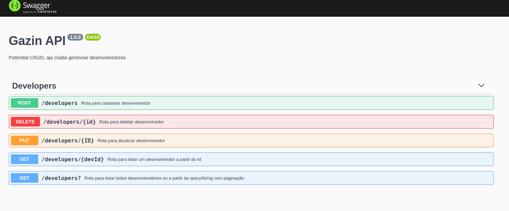

>## Rotas criadas:
-  1. GET /developers (Listar todos desenvolvedores)
-  2. GET /developers? (Listar desenvolvedores de acordo com a querystring e paginado)
-  3. GET /developers/{id} (Retorna os dados de um desenvolvedor)
-  4. POST /developers (Adiciona um novo desenvolvedor)
-  5. PUT /developers/{id} (Atualiza os dados de um desenvolvedor)
-  6. DELETE /developers/{id} (Deleta um desenvolvedor)
-  7. SWAGGER /docs (Documentação iterativa)

>## Oque foi utilizado:
-  NodeJS + TypeScript (Construção da API)
-  MongoDB (Banco não relacional) 
-  Clean Architecture (Estruturação do projeto)
-  Husky (Padronização de commit e push)
-  Lint staged (Auxiliar o husky na padronização)
-  Eslint (Padronização de código)
-  Jest (Usado para realizar os testes)
-  Faker (Criação de dados fakes para os testes)
-  Docker (Criado para subir o banco e os servidor)

>## Regras:
- O Sexo aceita "M" (Masculino) e "F" (Feminino)
- A listagem com queryString e paginação aceita todos campos (nome, sexo, idade, hobby, datanascimento e page para paginação), ex: /developers?nome=Matheus&sexo=M&page=2, irá listar todos os desenvolvedores encontrados com nome Matheus e sexo Masculino na página 2
- Cada página tem 5 usuários e caso não informada irá retornar todos
- Para datas utilizei o formato padrão do html yyyy-MM-dd

>## Swagger
- A documentação com o Swagger é bem fácil de usar, basta acessar a rota /docs e executar, ele funciona parecido com o insomnia, porém serve de documentação também :D
- As rotas estão com nomes (id, ID, devId) pois o swagger não permite rotas iguais, aí mudei o nome para diferenciar, porém no código é padronizado, como solicitado

>## Como executar - Api:
(É necessário do docker instalado, o backend irá usar a porta 5050 e o mongo a 27017)
-  git clone https://github.com/MatheusINFO/PotentialCRUD.git (clone o repositório e vá até a pasta)
-  npm install (irá instalar as dependências, utilizei a v.7 do npm, caso precise para atualizar use npm i -g npm@latest)
-  npm run docker (irá fazer o build, chamar o docker-compose up e remover a pasta de testes)

>## Como executar - Testes
(Na pasta clonada, execute os comandos)
- npm install (caso não tenha feito)
- npm run test (irá rodar todos os testes)
